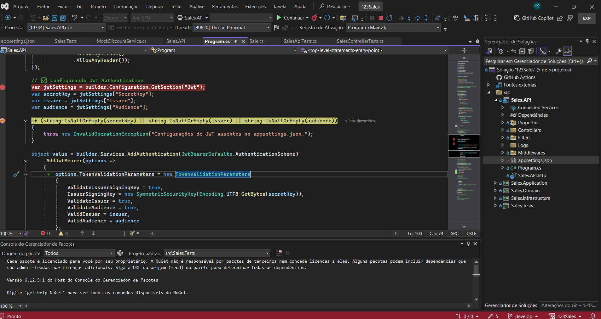
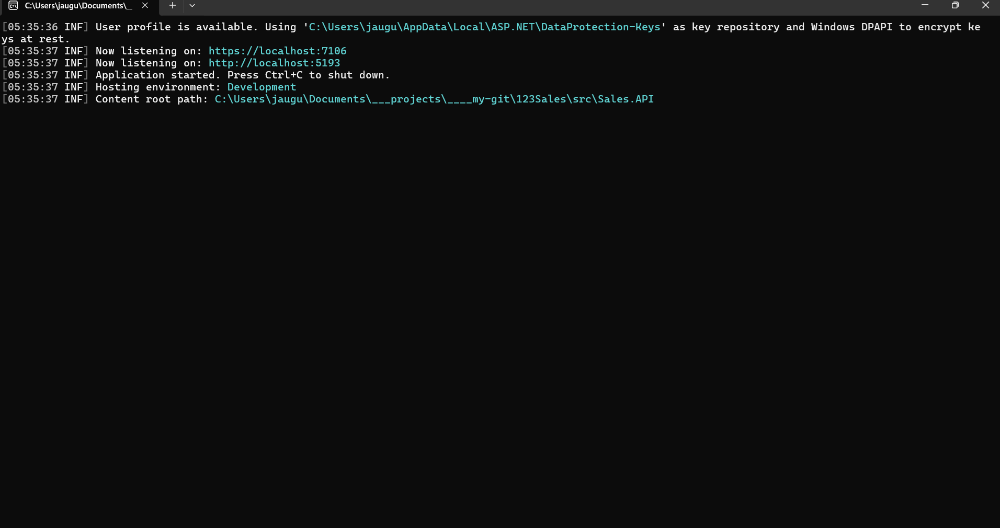

# Sales API - Backend Implementation

## Overview

The 123Vendas system is divided into multiple domains, including Inventory, CRM (Customer), and Sales. As a Sales team developer, you are required to implement a prototype API for managing sales.

Since we follow Domain-Driven Design (DDD), references to entities from other domains should use the **External Identities** pattern, with data denormalization for descriptive attributes.

## Features

- REST API using .NET Core 8 with JWT Authentication
- Backend for managing sales transactions
- Integration with external identity providers

## .Net Core 8 Layer Model (Universal Reference Architecture)

```plaintext
.github/                  # GitHub Actions configuration or other workflow settings
.vscode/                  # Visual Studio Code-specific configuration
src/                      # Source code folder
    Sales.API/            # API Layer (Controllers, Middlewares, Filters)
    Sales.Application/    # Application Layer (Use Cases, DTOs, Interfaces)
    Sales.Domain/         # Domain Layer (Entities, Aggregates, Domain Services)
    Sales.Infrastructure/ # Infrastructure Layer (Repositories, Database Context, External Integrations)
    Sales.Tests/          # Unit and Integration tests
docs/                     # Project documentation
scripts/                  # Automation scripts
.env                      # Environment variables file
docker-compose.yml        # Docker Compose file for multi-container configuration
Dockerfile                # Dockerfile for image building
README.md                 # Project description
```

## Dockerfile

Create a `Dockerfile` in the project root:

```dockerfile
# Use official .NET SDK image
FROM mcr.microsoft.com/dotnet/sdk:8.0 AS build-env
WORKDIR /app

# Copy only project files first (for caching restore step)
COPY src/Sales.API/*.csproj Sales.API/
COPY src/Sales.Application/*.csproj Sales.Application/
COPY src/Sales.Domain/*.csproj Sales.Domain/
COPY src/Sales.Infrastructure/*.csproj Sales.Infrastructure/

# Restore dependencies
WORKDIR /app/Sales.API
RUN dotnet restore Sales.API.csproj

# Copy the rest of the project files
COPY . .

# Build and publish the application
RUN dotnet publish Sales.API.csproj -c Release -o out

# Use lightweight runtime image
FROM mcr.microsoft.com/dotnet/aspnet:8.0
WORKDIR /app
COPY --from=build-env /app/Sales.API/out .

ENTRYPOINT ["dotnet", "Sales.API.dll"]
```

## Main Technologies Used - API (Backend Microservices)


---

## Technologies and Best Practices

- **Logging**: Use Serilog
- **Layered Architecture**: API, Application, Domain, Infrastructure separation
- **Git Workflow**: Implement Git Flow
- **Commit Practices**: Follow Semantic Commit standards
- **REST API Principles**: Implement RESTful API
- **Code Quality**: Clean Code, SOLID principles, DRY, YAGNI
- **Best Practices**: Object Calisthenics

## Install Required NuGet Packages

Run the following commands in the project root:

```sh
# Install logging framework
dotnet add package Serilog.AspNetCore

# Install unit testing frameworks
dotnet add package xunit
dotnet add package FluentAssertions
dotnet add package Bogus
dotnet add package NSubstitute

dotnet add package Microsoft.NET.Test.Sdk

# Install integration testing container
dotnet add package TestContainers
```

## Testing Requirements

- **Unit Testing**
  - Xunit
  - FluentAssertions
  - Bogus
  - NSubstitute
- **Integration Testing** (Recommended)
  - Testing Containers

## Installation and Setup

### Prerequisites

Ensure you have the following installed:

- .NET SDK 8.0+
- PostgreSQL 15.3+
- MongoDB 1.14.1+
- Docker (for containerized deployment)
- Visual Studio Code

### Database Configuration

Update `appsettings.json` with your database connection:

```json
{
  "ConnectionStrings": {
    "DefaultConnection": "Server=your_server;Database=SalesDB;User Id=your_user;Password=your_password;"
  }
}
```
## Docker Setup

### Install Dependencies

Check If dotnet restore Works Locally
Before running inside Docker, try running it manually:
```sh
dotnet restore src/Sales.API/Sales.API.csproj
```

To clear and reattempt, run:
```sh
dotnet nuget locals all --clear
dotnet restore src/Sales.API/Sales.API.csproj
```

 Verify Docker Build Context:
```sh
docker build -t sales-api .
```

If the error persists, check if the .csproj files are included in the container:
```sh
docker run --rm -it sales-api ls -R /app
```

Rebuild Docker Without Cache:
```sh
docker system prune -af
docker build --no-cache -t sales-api .
```

Use the following command to run the API:
```sh
docker run -d -p 5000:5000 --name sales-container sales-api
```

Execute unit and integration tests:
```sh
dotnet test
```

### Docker Compose Configuration

```yaml
version: '3.9'
services:
  app:
    build: .
    ports:
      - "5000:5000"
    volumes:
      - .:/app
    environment:
      - DATABASE_URL=postgresql://postgres:postgres@db:5432/sales_database
  db:
    image: postgres:15.3
    ports:
      - "5432:5432"
    environment:
      POSTGRES_USER: postgres
      POSTGRES_PASSWORD: postgres
      POSTGRES_DB: sales_database
  mongo:
    image: mongo
    ports:
      - "27017:27017"
    environment:
      MONGO_INITDB_ROOT_USERNAME: root
      MONGO_INITDB_ROOT_PASSWORD: root
```

## Debug

Debugging can be done in Visual Studio 2022:



## Access Mode: NoSQL, SQL and REST API

- Localhost: [Swagger local machine](http://localhost:5193/index.html)
  

## Mode: Console CMD

- Command Line: [Console CMD](#)
  
---

## Multi-Cloud, On-Premises, and Data Center Environment List

- Development: `environment-dev`
- Staging: `environment-hml`
- QA: `environment-qa`
- Production: `environment-prod`
