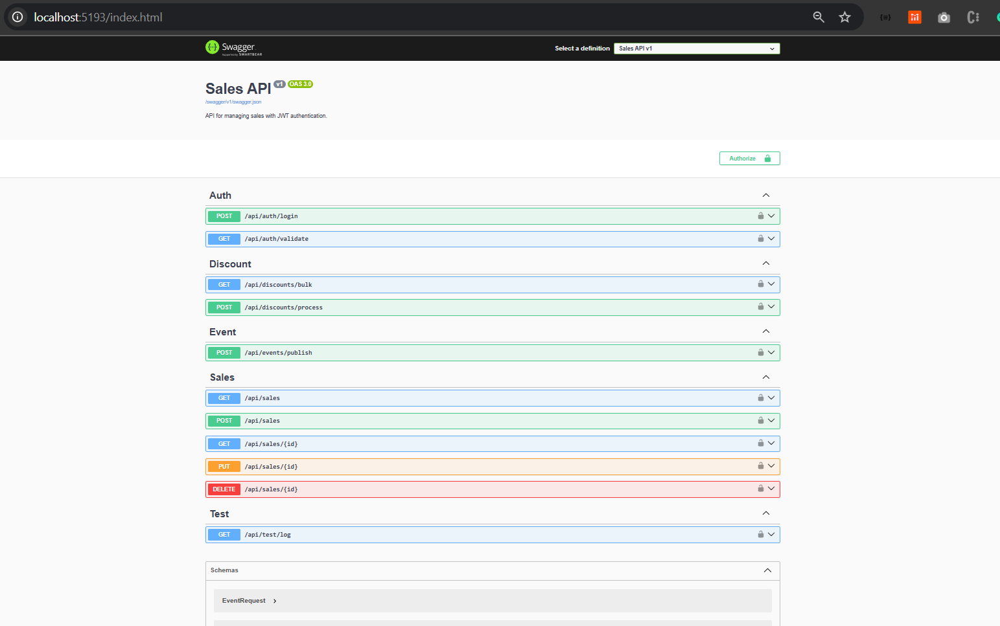

# 📌 Sales API - Backend Implementation

## 🏆 Overview

O **123Vendas** é um sistema composto por diversos domínios, incluindo **Inventário, CRM (Cliente) e Vendas**. Como desenvolvedor da equipe de Vendas, você precisa implementar um **protótipo de API** para gerenciamento de vendas.

Seguindo os princípios de **Domain-Driven Design (DDD)**, todas as referências a entidades de outros domínios devem seguir o padrão **Identidades Externas**, com **desnormalização de dados** para atributos descritivos.

---

## 🎯 Regras de Negócio

- **Desconto progressivo**:
  - **Compras acima de 4 itens iguais** recebem **10% de desconto**.
  - **Compras entre 10 e 20 itens iguais** recebem **20% de desconto**.
  - **Não é possível vender mais de 20 itens iguais**.
  - **Compras abaixo de 4 itens** não podem ter desconto.

---

## ⚙️ Arquitetura da API (Camadas)

A API segue uma arquitetura **bem definida e modular**, baseada nos princípios **Clean Architecture** e **DDD**:

```plaintext
.github/                  # Configuração do GitHub Actions e workflows
.vscode/                  # Configurações específicas do VS Code
src/                      # Código-fonte principal
    Sales.API/            # Camada de API (Controllers, Middlewares, Filters)
    Sales.Application/    # Camada de Aplicação (Use Cases, DTOs, Interfaces)
    Sales.Domain/         # Camada de Domínio (Entidades, Aggregates, Domain Services)
    Sales.Infrastructure/ # Camada de Infraestrutura (Repositórios, Banco de Dados, Integrações externas)
    Sales.Tests/          # Testes unitários e de integração
docs/                     # Documentação do projeto
scripts/                  # Scripts de automação
.env                      # Arquivo de variáveis de ambiente
docker-compose.yml        # Arquivo Docker Compose para configuração multi-container
Dockerfile                # Arquivo Dockerfile para build da aplicação
README.md                 # Descrição do projeto
```

---

## 🚀 Tecnologias Utilizadas

A aplicação utiliza as seguintes tecnologias e melhores práticas:

### 📌 Backend e Infraestrutura:
- **.NET Core 8** para desenvolvimento da API
- **PostgreSQL 15.3** como banco de dados relacional
- **MongoDB 1.14.1** como banco de dados NoSQL
- **Docker & Docker Compose** para conteinerização e deploy

### 🔍 Segurança e Autenticação:
- **JWT Authentication** para autenticação segura
- **Serilog** para logging estruturado

### 📌 Boas práticas de desenvolvimento:
- **Arquitetura em Camadas**: API, Application, Domain, Infrastructure
- **Git Flow Workflow** para organização dos branches
- **Commits Semânticos** para versionamento limpo
- **Princípios de Código**: REST API, Clean Code, SOLID, DRY, YAGNI, Object Calisthenics

### 🧪 Testes Automatizados:
- **XUnit** para testes unitários
- **FluentAssertions** para validação fluida
- **Bogus** para geração de dados fake
- **NSubstitute** para mocks
- **Test Containers** (desejável) para testes de integração com containers

---

## 📦 Instalação e Configuração

### 1️⃣ **Pré-requisitos**
Antes de iniciar, você precisará ter os seguintes softwares instalados:

- **.NET SDK 8.0+**
- **PostgreSQL 15.3+**
- **MongoDB 1.14.1+**
- **Docker** (para deploy containerizado)
- **Visual Studio Code ou Rider** (opcional)

### 2️⃣ **Instalação das Dependências**
Execute os seguintes comandos para instalar pacotes essenciais:

```sh
# Instalar logging com Serilog
dotnet add package Serilog.AspNetCore

# Instalar frameworks de testes
dotnet add package xunit
dotnet add package FluentAssertions
dotnet add package Bogus
dotnet add package NSubstitute
dotnet add package Microsoft.NET.Test.Sdk

# Instalar container de testes
dotnet add package TestContainers
```

### 3️⃣ **Configuração do Banco de Dados**
Edite o arquivo \`appsettings.json\` com as configurações do PostgreSQL:

```json
{
  "ConnectionStrings": {
    "SalesDB": "Host=localhost;Port=5432;Database=SalesDB;Username=postgres;Password=postgres;"
  }
}
```

---

## 🐳 Configuração Docker

### **1️⃣ Verificar Dependências**
Antes de rodar a API no Docker, valide se o restore do .NET funciona:

```sh
dotnet restore src/Sales.API/Sales.API.csproj
```

Caso precise limpar o cache e tentar novamente:

```sh
dotnet nuget locals all --clear
dotnet restore src/Sales.API/Sales.API.csproj
```

### **2️⃣ Construir e Rodar a API no Docker**
```sh
docker build -t sales-api .
docker run -d -p 5000:5000 --name sales-container sales-api
```

Para validar o build:
```sh
docker run --rm -it sales-api ls -R /app
```

Se houver erro, tente reconstruir sem cache:
```sh
docker system prune -af
docker build --no-cache -t sales-api .
```

### **3️⃣ Configuração com Docker Compose**
Crie um \`docker-compose.yml\` com a seguinte estrutura:

```yaml
version: '3.9'
services:
  app:
    build: .
    ports:
      - "5000:5000"
    environment:
      - DATABASE_URL=postgresql://postgres:postgres@db:5432/SalesDB
  db:
    image: postgres:15.3
    ports:
      - "5432:5432"
    environment:
      POSTGRES_USER: postgres
      POSTGRES_PASSWORD: postgres
      POSTGRES_DB: SalesDB
  mongo:
    image: mongo
    ports:
      - "27017:27017"
    environment:
      MONGO_INITDB_ROOT_USERNAME: root
      MONGO_INITDB_ROOT_PASSWORD: root
```

Para rodar:
```sh
docker-compose up -d
```

---

## 🛠️ Testes Automatizados

Execute os testes unitários e de integração:
```sh
dotnet test
```

---

## 🔗 Acesso à API

### **Swagger**
Acesse a documentação Swagger da API em:
[Swagger Local](http://localhost:5000/index.html)

- Localhost: [Swagger local machine](http://localhost:8080/swagger-ui/index.html)
  